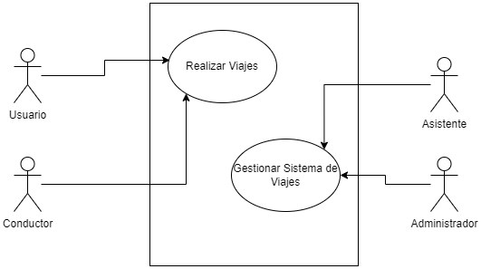
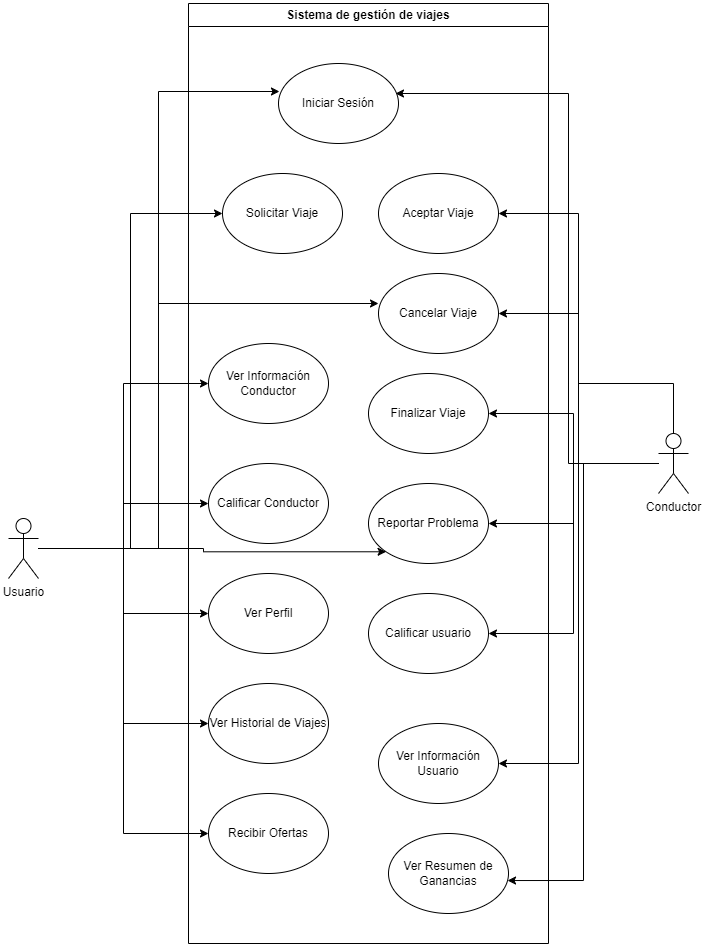
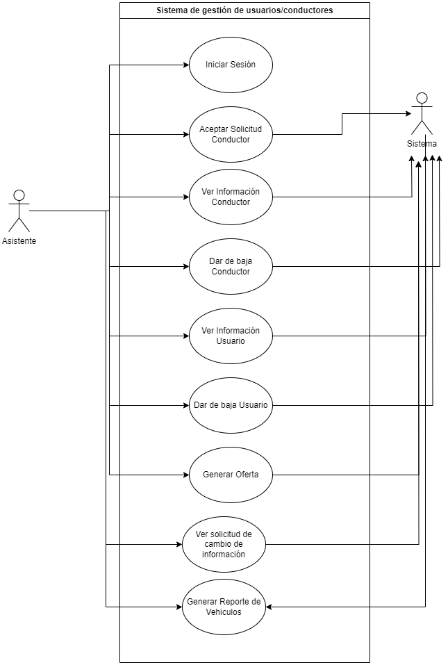
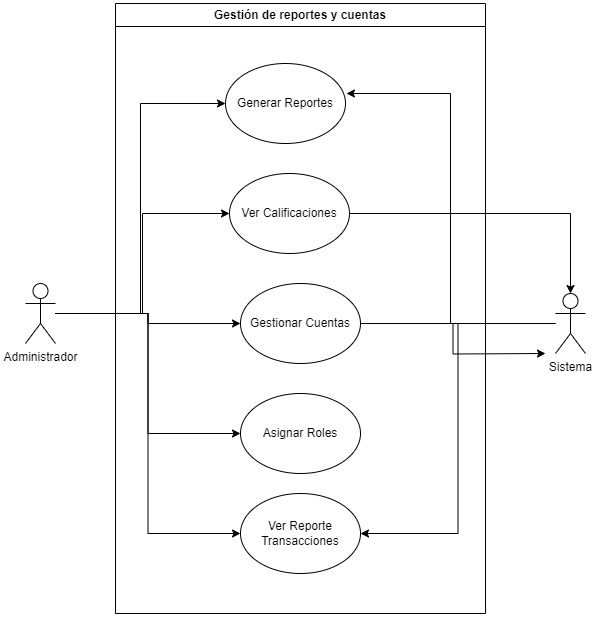

# Proyecto Fase 1 Qnave

> UNIVERSIDAD SAN CARLOS DE GUATEMALA
> FACULTAD DE INGENIERÍA  
> ESCUELA DE CIENCIAS Y SISTEMAS  
> LABORATORIO ANALISIS Y DISEÑO DE SISTEMAS 2   
> SECCIÓN A

| Nombre                          | Carnet    |
| ------------------------------- | --------- |
| Jose Carlos Moreira Paz         | 201701015 |
| Paula Gabriela García Reinoso   | 201700823 |
| José Fernando Recinos Acuté     | 201114236 |
| Vernik Carlos Alexander Yaxon Ortiz| 201712057 |

## Índice

- [Proyecto Fase 1](#ayd2_proyectof1_g3)
  - [Antecedentes](#antecedentes)
    - [Descripción](#descripcion)
  - [Core del negocio](#core-del-negocio)
    - [Casos de uso alto nivel](#casos-de-uso-alto-nivel)
  - [Requerimientos](#requerimientos)
    - [Requerimientos Funcionales](#requerimientos-funcionales)
    - [Requerimientos no Funcionales](#requerimientos-no-funcionales)
  - [Casos de uso expandidos](#casos-de-uso-expandidos)
    - [Casos de uso para rol de conductor](#casos-de-uso-para-el-rol-de-conductor)
    - [Casos de uso para rol de usuario](#casos-de-uso-para-el-rol-de-usuario)
    - [Casos de uso para rol de asistente](#casos-de-uso-para-el-rol-de-asistente)
    - [Casos de uso para rol de administrador](#casos-de-uso-para-el-rol-de-administrador)
  - [Diagrama Entidad Relacion](#Diagrama-2)
    

## Antecedentes
- **Creciente Inseguridad y sus Efectos en la Operatividad**: La ola de delincuencia organizada en Guatemala ha sido un desafío dificil de manejar, afectando la confianza tanto de los conductores como de los usuarios. Los incidentes de asaltos y fraudes no solo deterioraron la percepción de seguridad, sino que también resultaron en la pérdida de personal clave, lo que afectó gravemente la capacidad operativa de las empresas de trasporte provado.
- **Crecimiento de la industra de Transporte Privado en la actualidad** : A nivel mundial, las aplicaciones de transporte privado, como Uber, inDrive, y Yango, han transformado la manera en que las personas se desplazan en entornos urbanos. La comodidad de solicitar un viaje a través de una aplicación, junto con opciones de pago digital y seguimiento en tiempo real, ha creado un estándar global en la industria del transporte, impulsando una demanda creciente y cambiando las expectativas de los usuarios en términos de seguridad y eficiencia.
- **Tendencias**: El avance de tecnologías móviles y la penetración del uso de smartphones han permitido la creación de aplicaciones más robustas y adaptables. Esto incluye el uso de APIs de geolocalización, sistemas de pago en línea, y algoritmos de optimización de rutas, que son esenciales para el funcionamiento eficiente de una aplicación de transporte.
- **Competencia**: Con la inseguridad afectando, los usuarios prefieren utilizar las aplicaciones que garanticen su seguridad y servicios más confiables. Esta situación resalta la importancia de desarrollar una solución tecnológica que no solo modernice las operaciones, sino que también recupere la confianza del mercado.
- **Regulacion**: La expansión global de las aplicaciones de transporte privado ha llevado a un aumento en la regulación gubernamental, con muchos países implementando leyes para proteger a los usuarios y garantizar condiciones laborales justas para los conductores. Empresas como Uber han tenido que adaptarse a regulaciones que varían de un país a otro, incluyendo la adopción de seguros, licencias especiales, y estándares de seguridad. Esto subraya la importancia de desarrollar una aplicación que no solo sea segura y eficiente, sino también conforme a las regulaciones locales y capaz de adaptarse a posibles cambios legales futuros.
- **Necesidad de Innovación**: Reconociendo las limitaciones de su sistema actual, Por ello se decide explorar soluciones tecnológicas que mejoren la seguridad y eficiencia del servicio. Aunque se presentó una propuesta preliminar por parte de un programador freelance, las deficiencias en la documentación y la falta de claridad en la propuesta generaron preocupaciones sobre la viabilidad y sostenibilidad a largo plazo de la solución.
- **Expectativas**: El objetivo de modernizar Qnave es desarrollar una solución integral que aborde los desafíos actuales y siente las bases para el crecimiento futuro, incluyendo un software flexible y escalable, medidas de seguridad avanzadas, y mejoras en la experiencia del usuario y la eficiencia operativa.

## Core del negocio

### Descripción
Qnave inicio sus operaciones en el año 2020 para dar solución a las problematicas del pais, desde su creación la compañia se ha enfrentado a los retos derivados de la pandemia global, esto impulso a Qnave a darle un giro de negocio para satisfacer las necesidades mas importantes de los clientes para ello el modelo se basa en llamadas telefónicas entre los usuarios y los conductores, esta modalidad permitió mantener a flote la empresa por un periodo de tiempo pero pronto surgieron mas desafios que complicaron el funcionamiento de la empresa.

La delincuencia fue un factor detonante en la modalidad y el giro del negocio que optaba Qnave, al aumentar la ola de inseguridad y el crimen organizado en el pais, los conductores y usuarios fueron los mas afectados obligando a los conductores a buscar otras maneras de ganarse la vida con trabajos de menor riesgo y los usuarios al sentirse inseguros optaban por utilizar los servicios de las otras empresas competidoras.

Se busca generar una solucion y proponer una documentación completa y satisfacer todos los problemas y conflictos que actualmente aquejan a la empresa Qnave, se requiere satisfacer las expectativas en terminos de seguridad, escalabilidad y viabilidad a largo plazo, ademas se propone que los costos de operacion del sistema no sean excesivamente altos ya que la sostenibilidad a largo plazo es una de las prioridades.

## Casos de Uso de alto nivel

### CDU de alto nivel

### Primera descomposición

 
## Requerimientos

### Requerimientos funcionales 
#### Registros
1. Registro de Usuario: Los usuarios deben poder registrarse proporcionando su nombre completo, fecha de nacimiento, género, correo electrónico, fotografía del DPI, número de celular, contraseña y confirmación de contraseña.
2. Registro de conductor: Los conductores deben registrarse proporcionando: Nombre completo, Número de teléfono, Edad, Número de DPI, Correo electrónico, Currículum vitae (CV) en formato PDF, Fotografía, Fotografía del vehículo, Número de placa, Marca del vehículo, Año del vehículo, Género, Estado civil, Número de cuenta
y Dirección de domicilio
3. Registro de Asistentes: Los asistentes deben ser registrados por el administrador con la siguiente información: Nombre completo, Número de teléfono, Edad, Número de DPI, Correo electrónico, Currículum vitae (CV), Fotografía, Género, Estado civil, Número de cuenta y Dirección de domicilio
#### Usuarios
1. Inicio de Sesión: Los usuarios deben poder iniciar sesión en la aplicación utilizando su correo electrónico y contraseña.
2. Modificar información: El usuario puede cambiar algún dato personal que ingresó al registrarse.
3. Calificar conductor:Después de un viaje, el usuario puede darle una calificación al conductor.
4. Ver información del conductor: el usuario puede ver la informacion del conductor que hara su viaje.
5. Reportar algún problema: El usuario puede reportar el problema desde la aplicación.
6. Métodos de pago: El usuario puede pagar en efectivo o con tarjeta.
7. Guardar ubicación de viaje: El usuario puede guardar direcciones frecuentes.
8. Cancelar viaje: Si el usuario necesita cancelar un viaje, puede hacerlo y explicar por qué.
9. Pedir viaje: El usuario podrá pedir viajes desde la aplicación indicando su punto de partida y punto de llegada.
#### Conductor
1. Inicio de sesión: El conductor puede acceder a la plataforma de dos maneras: usando su correo y contraseña, o con su código de trabajador, que se le asigna al registrarse.
2. Aceptar viaje: Cuando un usuario solicita un viaje, la notificación se envía a todos los conductores. El sistema evita que dos conductores acepten al mismo pasajero, asegurando que solo uno lo tome.
3. Cancelar viaje: Si un conductor ya aceptó un viaje, puede cancelarlo si es necesario. 
4. Modificar información: El conductor puede actualizar su información personal o la de su vehículo enviando un documento con los cambios que quiere hacer. 
5. Reportar un problema: Si el conductor enfrenta algún problema, puede reportarlo en la plataforma, describiendo lo ocurrido y la fecha en que sucedió.
6. Calificar usuarios: El conductor puede calificar al usuario después de completar un viaje, usando un sistema de estrellas, para evaluar su comportamiento.
7. Ver información del usuario: Antes de aceptar un viaje, el conductor puede revisar la información básica del usuario, como su nombre, calificación general, y comentarios de otros conductores.
8. Finalizar viaje: Cuando el conductor llega al destino, debe indicar que el viaje ha terminado. La plataforma registrará la fecha y detalles del viaje.
9. Resumen de ganancias: El conductor puede ver cuánto ha ganado. A medianoche, la plataforma guarda ese total en un historial y lo reinicia para el día siguiente. También puede ver el acumulado total de todas sus ganancias anteriores.

#### Asistente
1. Inicio de sesión: El asistente puede acceder a la plataforma usando su correo y contraseña o con un código de trabajador asignado al registrarse.
2. Aceptar solicitud de empleo a conductores: El asistente revisa las solicitudes de empleo de los conductores. 
3. Ver información de los conductores: El asistente puede ver detalles sobre los conductores. 
4. Dar de baja a un conductor: El asistente puede dar de baja a un conductor por incumplir políticas, recibir muchas quejas, o a solicitud del propio conductor. 
5. Ver información de los usuarios: El asistente también puede ver información de los usuarios registrados.
6. Dar de baja a un usuario
En caso de comportamiento inapropiado, el asistente puede dar de baja a un usuario.
7. Generar ofertas para los usuarios: El asistente puede crear ofertas especiales para los usuarios, aplicando descuentos según lo considere necesario.
8. Ver solicitud de cambios de información del conductor:
El asistente revisa los documentos que los conductores envían para actualizar su información y realiza los cambios necesarios.
9. Reporte de los vehículos: El asistente puede generar y ver reportes detallados sobre los
##### Administrador
1. Generar reportes: El administrador puede crear reportes que muestren datos importantes sobre el funcionamiento de la plataforma, incluyendo las calificaciones de usuarios y conductores, estadísticas de registro, uso, y ganancias.
2. Ver calificaciones: El administrador tiene acceso a las calificaciones de todos los usuarios y conductores, lo que le permite monitorear la calidad del servicio.
3. Estadísticas registro: El administrador puede ver gráficos que muestran la cantidad de usuarios, conductores, y asistentes registrados en la plataforma.
4. Estadísticas de uso: El administrador puede ver gráficos que muestran cuántos viajes se han completado, cuántos se han cancelado, y cuántos están en espera.
5. Reporte de Ganancia: El administrador puede ver cuánto ha ganado la plataforma, tanto en bruto como en neto, con cada viaje. Puede filtrar estos reportes por fecha para un control más detallado.
6. Contratar asistentes: El administrador puede contratar nuevos asistentes, creando sus perfiles en el sistema, asignándoles credenciales, y configurando sus permisos según el rol que desempeñarán.
7. Dar de baja a un asistente: Si un asistente ya no es necesario o no está cumpliendo con sus funciones, el administrador puede desactivar su cuenta y reasignar sus tareas a otros miembros del equipo. Esta acción queda registrada en el sistema para seguimiento.
### Requerimientos no funcionales 
1. Seguridad: La aplicación debe garantizar la protección de los datos personales de los usuarios y la información de pago.
2. Escalabilidad: El sistema debe ser capaz de manejar un aumento en el número de usuarios y solicitudes de viaje sin degradar el rendimiento.
3. Usabilidad: La interfaz de usuario debe ser intuitiva y fácil de usar, garantizando una buena experiencia para el usuario.
4. Disponibilidad: La aplicación debe estar disponible y operativa en todo momento, con un tiempo de inactividad mínimo.
5. Rendimiento: La aplicación debe responder rápidamente a las solicitudes de los usuarios, con tiempos de carga mínimos.
6. Compatibilidad: La aplicación debe ser compatible con diferentes dispositivos y sistemas operativos móviles.
7. Seguridad de Datos: Toda la información sensible, incluyendo datos personales y transacciones financieras, debe estar cifrada en tránsito y en reposo utilizando protocolos de seguridad.
8. Autenticación Segura: El sistema debe contar con mecanismos robustos de autenticación y autorización para asegurar que cada tipo de usuarios este autorizado para acceder a sus funcionalidades respectivas.
9. Soporte para Usuarios Simultáneos: La aplicación debe soportar un gran número de usuarios y conductores simultáneamente sin degradar el rendimiento.
10. Rendimiento del Sistema: La aplicación debe responder a las solicitudes de los usuarios en el minimo periodo de tiempo y procesar la información de forma veloz.
11. Facilidad de Mantenimiento: El sistema debe ser modular, permitiendo actualizaciones o reemplazos de componentes sin afectar la operación, y contar con documentación técnica detallada y actualizada.
12. Cumplimiento Normativo: El sistema debe cumplir con regulaciones locales e internacionales aplicables, como las de protección de datos, y mantener un registro detallado de todas las transacciones y actividades para auditorías.

## Casos de uso expandidos 

### Casos de Uso para el Rol de Conductor

#### Inicio de sesión conductor: CDU001
| **Descripción** | El conductor inicia sesión en la plataforma utilizando su correo y contraseña, o su código de trabajador asignado al registrarse. |
|-----------------|-------------------------------------------------------------------------------------------------------|
| **Actores**     | Conductor                                                                                              |
| **Secuencia Normal** | **Paso**                                                                                               |
|                 | 1. El conductor accede a la página de inicio de sesión.                                                |
|                 | 2. Ingresa su correo y contraseña, o su código de trabajador.                                           |
|                 | 3. El sistema valida las credenciales.                                                                 |
|                 | 4. Si las credenciales son correctas, el sistema permite el acceso.                                     |
| **Excepciones** | **Paso**                                                                                                   |
|                 | A1. Si las credenciales son incorrectas, el sistema muestra un mensaje de error.                        |

#### Aceptar viaje conductor CDU: CDU002
| **Descripción** | El conductor acepta un viaje solicitado por un usuario.                                                |
|-----------------|-------------------------------------------------------------------------------------------------------|
| **Actores**     | Conductor                                                                                              |
| **Secuencia Normal** | **Paso**                                                                                               |
|                 | 1. El sistema notifica al conductor sobre un nuevo viaje disponible.                                    |
|                 | 2. El conductor revisa la información del usuario y del viaje.                                          |
|                 | 3. El conductor acepta el viaje.                                                                        |
|                 | 4. El sistema asigna el viaje al conductor y notifica al usuario.                                       |
| **Excepciones** | **Paso**                                                                                                   |
|                 | A1. Si otro conductor acepta el viaje primero, el sistema notifica que el viaje ya ha sido tomado.     |

#### Cancelar viaje conductor CDU: CDU003
| **Descripción** | El conductor cancela un viaje que ya había aceptado.                                                    |
|-----------------|-------------------------------------------------------------------------------------------------------|
| **Actores**     | Conductor                                                                                              |
| **Secuencia Normal** | **Paso**                                                                                               |
|                 | 1. El conductor selecciona el viaje en curso.                                                          |
|                 | 2. Cancela el viaje proporcionando una razón.                                                          |
|                 | 3. El sistema registra la cancelación y notifica al usuario.                                           |
|                 | 4. El sistema reasigna el viaje a otro conductor disponible.                                           |
| **Excepciones** | **Paso**                                                                                                   |
|                 | A1. Si no hay otro conductor disponible, el sistema notifica al usuario que el viaje ha sido cancelado.|

#### Finalizar viaje CDU: CDU004
| **Descripción** | El conductor finaliza un viaje cuando llega al destino.                                                |
|-----------------|-------------------------------------------------------------------------------------------------------|
| **Actores**     | Conductor                                                                                              |
| **Secuencia Normal** | **Paso**                                                                                               |
|                 | 1. El conductor indica en la aplicación que ha llegado al destino.                                     |
|                 | 2. El sistema registra la finalización del viaje y actualiza las ganancias del conductor.              |
|                 | 3. El usuario es notificado de la finalización del viaje.                                              |
| **Excepciones** | **Paso**                                                                                                   |
|                 | A1. Si el sistema no puede registrar la finalización, el conductor debe intentar nuevamente.           |

#### Información conductor CDU: CDU005
| **Descripción** | El conductor actualiza su información personal o la de su vehículo enviando un documento (PDF) con los cambios que quiere hacer. |
|-----------------|-------------------------------------------------------------------------------------------------------|
| **Actores**     | Conductor, Asistente                                                                                   |
| **Secuencia Normal** | **Paso**                                                                                               |
|                 | 1. El conductor accede a su perfil y selecciona la opción de modificar información.                     |
|                 | 2. Sube un documento (PDF) con los cambios que desea realizar.                                         |
|                 | 3. El sistema notifica al asistente sobre la solicitud de modificación.                                 |
|                 | 4. El asistente revisa la solicitud y aprueba o rechaza los cambios.                                    |
|                 | 5. El sistema actualiza la información si la solicitud es aprobada.                                     |
| **Excepciones** | **Paso**                                                                                                   |
|                 | A1. Si el documento no cumple con los requisitos, el sistema notifica al conductor para corregirlo.     |

#### Reporte de problama conductor CDU: CDU006
| **Descripción** | El conductor reporta un problema en la plataforma, describiendo lo ocurrido y la fecha en que sucedió.  |
|-----------------|-------------------------------------------------------------------------------------------------------|
| **Actores**     | Conductor                                                                                              |
| **Secuencia Normal** | **Paso**                                                                                               |
|                 | 1. El conductor accede a la opción de reportar un problema.                                            |
|                 | 2. Describe el problema y selecciona la fecha en que ocurrió.                                          |
|                 | 3. El sistema registra el reporte y lo envía al equipo de soporte.                                     |
|                 | 4. El equipo de soporte revisa y gestiona el reporte.                                                  |
| **Excepciones** | **Paso**                                                                                                   |
|                 | A1. Si la descripción del problema es insuficiente, el sistema solicita más detalles.                  |

#### Calificar usuario CDU: CDU007
| **Descripción** | El conductor califica al usuario después de completar un viaje, usando un sistema de estrellas.         |
|-----------------|-------------------------------------------------------------------------------------------------------|
| **Actores**     | Conductor                                                                                              |
| **Secuencia Normal** | **Paso**                                                                                               |
|                 | 1. El conductor finaliza el viaje.                                                                     |
|                 | 2. El sistema muestra la opción de calificar al usuario.                                               |
|                 | 3. El conductor selecciona una calificación de 1 a 5 estrellas y, opcionalmente, deja un comentario.    |
|                 | 4. El sistema registra la calificación y el comentario.                                                |
| **Excepciones** | **Paso**                                                                                                   |
|                 | A1. Si el conductor no deja una calificación, el sistema lo guarda como "Sin calificación".            |

#### Conductor ve información usuario CDU: CDU008
| **Descripción** | El conductor revisa la información básica del usuario antes de aceptar un viaje.                       |
|-----------------|-------------------------------------------------------------------------------------------------------|
| **Actores**     | Conductor                                                                                              |
| **Secuencia Normal** | **Paso**                                                                                               |
|                 | 1. El conductor recibe la notificación de un viaje disponible.                                         |
|                 | 2. Revisa la información básica del usuario, como nombre, calificación general, y comentarios de otros conductores. |
|                 | 3. Decide si acepta o no el viaje basado en la información proporcionada.                               |
| **Excepciones** | **Paso**                                                                                                   |
|                 | A1. Si el sistema no puede mostrar la información, el conductor solo puede ver los detalles mínimos del viaje. |

#### Resumen de ganancias conductor CDU: CDU009
| **Descripción** | El conductor visualiza un resumen de sus ganancias diarias y el acumulado total.                       |
|-----------------|-------------------------------------------------------------------------------------------------------|
| **Actores**     | Conductor                                                                                              |
| **Secuencia Normal** | **Paso**                                                                                               |
|                 | 1. El conductor accede a la opción de "Resumen de Ganancias".                                          |
|                 | 2. El sistema muestra las ganancias del día actual.                                                    |
|                 | 3. A medianoche, el sistema guarda el total diario en un historial y reinicia el conteo.               |
|                 | 4. El conductor puede ver un historial con el acumulado total de todas sus ganancias anteriores.       |
| **Excepciones** | **Paso**                                                                                                   |
|                 | A1. Si el sistema no puede calcular las ganancias, el conductor recibe un mensaje de error.           |

### Casos de Uso para el Rol de Usuario

#### Inicio de sesion CDU: CDU010
| **Descripción** | El usuario inicia sesión en la plataforma utilizando su correo y contraseña, o su cuenta de redes sociales. |
|-----------------|------------------------------------------------------------------------------------------------------------|
| **Actores**     | Usuario                                                                                                     |
| **Secuencia Normal** | **Paso**                                                                                                   |
|                 | 1. El usuario accede a la página de inicio de sesión.                                                      |
|                 | 2. Ingresa su correo y contraseña, o selecciona la opción de iniciar sesión con redes sociales.            |
|                 | 3. El sistema valida las credenciales o autentica con la red social.                                       |
|                 | 4. Si las credenciales son correctas, el sistema permite el acceso.                                         |
| **Excepciones** | **Paso**                                                                                                       |
|                 | A1. Si las credenciales son incorrectas, el sistema muestra un mensaje de error.                           |
|                 | A2. Si la autenticación con la red social falla, el sistema sugiere intentar nuevamente o usar otra opción. |

#### Solicitar viaje usuario CDU: CDU011
| **Descripción** | El usuario solicita un viaje indicando su ubicación actual y su destino.                                      |
|-----------------|------------------------------------------------------------------------------------------------------------|
| **Actores**     | Usuario                                                                                                     |
| **Secuencia Normal** | **Paso**                                                                                                   |
|                 | 1. El usuario accede a la opción de "Solicitar Viaje" en la plataforma.                                      |
|                 | 2. Ingresa su ubicación actual y el destino deseado.                                                        |
|                 | 3. El sistema calcula la tarifa estimada y muestra los detalles del viaje.                                   |
|                 | 4. El usuario confirma la solicitud del viaje.                                                              |
|                 | 5. El sistema notifica a los conductores disponibles en la zona.                                            |
| **Excepciones** | **Paso**                                                                                                       |
|                 | A1. Si no hay conductores disponibles, el sistema informa al usuario y sugiere intentar más tarde.          |

#### Cancelar viaje usuario CDU: CDU012
| **Descripción** | El usuario cancela un viaje que ya había solicitado.                                                         |
|-----------------|------------------------------------------------------------------------------------------------------------|
| **Actores**     | Usuario                                                                                                     |
| **Secuencia Normal** | **Paso**                                                                                                   |
|                 | 1. El usuario selecciona el viaje en curso.                                                                 |
|                 | 2. Cancela el viaje proporcionando una razón.                                                               |
|                 | 3. El sistema registra la cancelación y notifica al conductor asignado.                                     |
| **Excepciones** | **Paso**                                                                                                       |
|                 | A1. Si el viaje ya ha comenzado, el sistema informa al usuario que la cancelación no es posible.            |

#### Ver informacion conductor CDU: CDU013
| **Descripción** | El usuario revisa la información básica del conductor antes de que el viaje comience.                       |
|-----------------|------------------------------------------------------------------------------------------------------------|
| **Actores**     | Usuario                                                                                                     |
| **Secuencia Normal** | **Paso**                                                                                                   |
|                 | 1. El usuario recibe la notificación de que un conductor ha aceptado su solicitud de viaje.                 |
|                 | 2. Revisa la información básica del conductor, como nombre, calificación general, y comentarios de otros usuarios. |
|                 | 3. El usuario puede decidir si procede con el viaje o lo cancela basado en la información proporcionada.    |
| **Excepciones** | **Paso**                                                                                                       |
|                 | A1. Si el sistema no puede mostrar la información, el usuario solo puede ver los detalles mínimos del conductor. |

#### Calificar conductor CDU: CDU014
| **Descripción** | El usuario califica al conductor después de completar un viaje, usando un sistema de estrellas.             |
|-----------------|------------------------------------------------------------------------------------------------------------|
| **Actores**     | Usuario                                                                                                     |
| **Secuencia Normal** | **Paso**                                                                                                   |
|                 | 1. El viaje finaliza y el sistema muestra la opción de calificar al conductor.                              |
|                 | 2. El usuario selecciona una calificación de 1 a 5 estrellas y, opcionalmente, deja un comentario.          |
|                 | 3. El sistema registra la calificación y el comentario.                                                    |
| **Excepciones** | **Paso**                                                                                                       |
|                 | A1. Si el usuario no deja una calificación, el sistema lo guarda como "Sin calificación".                  |

#### Información de perfil usuario CDU: CDU015
| **Descripción** | El usuario actualiza su información personal en su perfil de la plataforma.                                 |
|-----------------|------------------------------------------------------------------------------------------------------------|
| **Actores**     | Usuario                                                                                                     |
| **Secuencia Normal** | **Paso**                                                                                                   |
|                 | 1. El usuario accede a su perfil en la plataforma.                                                          |
|                 | 2. Selecciona la opción de modificar su información personal.                                               |
|                 | 3. Realiza los cambios necesarios y guarda la información.                                                 |
|                 | 4. El sistema actualiza la información del usuario en la base de datos.                                     |
| **Excepciones** | **Paso**                                                                                                       |
|                 | A1. Si el sistema no puede guardar los cambios, muestra un mensaje de error solicitando que intente nuevamente. |

#### Ver historial de viajes CDU: CDU016
| **Descripción** | El usuario revisa su historial de viajes completados.                                                       |
|-----------------|------------------------------------------------------------------------------------------------------------|
| **Actores**     | Usuario                                                                                                     |
| **Secuencia Normal** | **Paso**                                                                                                   |
|                 | 1. El usuario accede a la opción de "Historial de Viajes".                                                  |
|                 | 2. El sistema muestra una lista de todos los viajes completados por el usuario.                             |
|                 | 3. El usuario puede seleccionar un viaje específico para ver más detalles.                                 |
| **Excepciones** | **Paso**                                                                                                       |
|                 | A1. Si el sistema no puede acceder al historial, muestra un mensaje de error indicando la falta de datos.   |

#### Recepción de ofertas usuario CDU: CDU0017
| **Descripción** | El usuario recibe ofertas especiales y descuentos generados por el asistente.                               |
|-----------------|------------------------------------------------------------------------------------------------------------|
| **Actores**     | Usuario, Asistente                                                                                          |
| **Secuencia Normal** | **Paso**                                                                                                   |
|                 | 1. El asistente genera una oferta especial o descuento.                                                     |
|                 | 2. El sistema notifica al usuario sobre la nueva oferta disponible.                                         |
|                 | 3. El usuario revisa la oferta en su perfil o en la sección de notificaciones.                               |
| **Excepciones** | **Paso**                                                                                                       |
|                 | A1. Si la oferta ya no es válida, el sistema informa al usuario cuando intenta aplicarla.                   |

#### Reporte de problema usuario CDU: CDU018
| **Descripción** | El usuario reporta un problema con un viaje o con la plataforma.                                             |
|-----------------|------------------------------------------------------------------------------------------------------------|
| **Actores**     | Usuario                                                                                                     |
| **Secuencia Normal** | **Paso**                                                                                                   |
|                 | 1. El usuario accede a la opción de reportar un problema.                                                  |
|                 | 2. Describe el problema y selecciona el viaje relacionado, si aplica.                                      |
|                 | 3. El sistema registra el reporte y lo envía al equipo de soporte.                                         |
|                 | 4. El equipo de soporte revisa y gestiona el reporte.                                                      |
| **Excepciones** | **Paso**                                                                                                       |
|                 | A1. Si la descripción del problema es insuficiente, el sistema solicita más detalles.                      |

### Casos de Uso para el Rol de Asistente

#### Inicio de sesion asistente CDU: CDU019
| **Descripción** | El asistente inicia sesión en la plataforma utilizando su correo y contraseña, o su código de trabajador. |
|-----------------|---------------------------------------------------------------------------------------------------------|
| **Actores**     | Asistente                                                                                               |
| **Secuencia Normal** | **Paso**                                                                                                |
|                 | 1. El asistente accede a la página de inicio de sesión.                                                  |
|                 | 2. Ingresa su correo y contraseña, o su código de trabajador.                                            |
|                 | 3. El sistema valida las credenciales.                                                                   |
|                 | 4. Si las credenciales son correctas, el sistema permite el acceso.                                      |
| **Excepciones** | **Paso**                                                                                                    |
|                 | A1. Si las credenciales son incorrectas, el sistema muestra un mensaje de error.                         |

#### Aceptar solicitud de conductor CDU: CDU020
| **Descripción** | El asistente revisa y acepta las solicitudes de empleo de nuevos conductores.                            |
|-----------------|---------------------------------------------------------------------------------------------------------|
| **Actores**     | Asistente                                                                                               |
| **Secuencia Normal** | **Paso**                                                                                                |
|                 | 1. El asistente accede a la lista de solicitudes de empleo de conductores.                               |
|                 | 2. Revisa la información y documentos proporcionados por el solicitante.                                 |
|                 | 3. Si todo está en orden, aprueba la solicitud.                                                          |
|                 | 4. El sistema notifica al conductor que su solicitud ha sido aprobada.                                   |
| **Excepciones** | **Paso**                                                                                                    |
|                 | A1. Si la información está incompleta o es incorrecta, el asistente rechaza la solicitud e informa al solicitante. |

#### Ver información conductores CDU: CDU021
| **Descripción** | El asistente revisa los detalles de los conductores, incluyendo historial de viajes y calificaciones.     |
|-----------------|---------------------------------------------------------------------------------------------------------|
| **Actores**     | Asistente                                                                                               |
| **Secuencia Normal** | **Paso**                                                                                                |
|                 | 1. El asistente accede a la sección de conductores en la plataforma.                                     |
|                 | 2. Selecciona un conductor específico para revisar su historial y calificaciones.                        |
|                 | 3. El sistema muestra la información detallada del conductor.                                            |
| **Excepciones** | **Paso**                                                                                                    |
|                 | A1. Si el sistema no puede acceder a la información del conductor, muestra un mensaje de error.          |

#### Dar de baja conductor CDU: CDU022
| **Descripción** | El asistente da de baja a un conductor debido a incumplimientos o a solicitud del propio conductor.       |
|-----------------|---------------------------------------------------------------------------------------------------------|
| **Actores**     | Asistente                                                                                               |
| **Secuencia Normal** | **Paso**                                                                                                |
|                 | 1. El asistente accede a la lista de conductores activos.                                               |
|                 | 2. Selecciona al conductor que desea dar de baja.                                                        |
|                 | 3. Registra el motivo de la baja en el sistema.                                                          |
|                 | 4. El sistema desactiva la cuenta del conductor y guarda el registro.                                    |
| **Excepciones** | **Paso**                                                                                                    |
|                 | A1. Si la baja no puede ser procesada, el sistema muestra un mensaje de error.                           |

#### Ver información de usuarios CDU: CDU023
| **Descripción** | El asistente revisa la información de los usuarios registrados en la plataforma.                         |
|-----------------|---------------------------------------------------------------------------------------------------------|
| **Actores**     | Asistente                                                                                               |
| **Secuencia Normal** | **Paso**                                                                                                |
|                 | 1. El asistente accede a la lista de usuarios en la plataforma.                                          |
|                 | 2. Selecciona un usuario específico para ver su historial de viajes y comentarios recibidos.             |
|                 | 3. El sistema muestra la información detallada del usuario.                                              |
| **Excepciones** | **Paso**                                                                                                    |
|                 | A1. Si el sistema no puede acceder a la información del usuario, muestra un mensaje de error.            |

#### Dar de baja usuario CDU: CDU024
| **Descripción** | El asistente da de baja a un usuario debido a comportamiento inapropiado.                                |
|-----------------|---------------------------------------------------------------------------------------------------------|
| **Actores**     | Asistente                                                                                               |
| **Secuencia Normal** | **Paso**                                                                                                |
|                 | 1. El asistente accede a la lista de usuarios activos.                                                   |
|                 | 2. Selecciona al usuario que desea dar de baja.                                                          |
|                 | 3. Registra el motivo de la baja en el sistema.                                                          |
|                 | 4. El sistema desactiva la cuenta del usuario y guarda el registro.                                      |
| **Excepciones** | **Paso**                                                                                                    |
|                 | A1. Si la baja no puede ser procesada, el sistema muestra un mensaje de error.                           |

#### Generar ofertas CDU: CDU025
| **Descripción** | El asistente genera ofertas especiales y descuentos para los usuarios de la plataforma.                  |
|-----------------|---------------------------------------------------------------------------------------------------------|
| **Actores**     | Asistente                                                                                               |
| **Secuencia Normal** | **Paso**                                                                                                |
|                 | 1. El asistente accede a la sección de ofertas en la plataforma.                                         |
|                 | 2. Crea una nueva oferta, definiendo los parámetros como porcentaje de descuento y período de validez.   |
|                 | 3. El sistema guarda la oferta y la notifica a los usuarios elegibles.                                   |
| **Excepciones** | **Paso**                                                                                                    |
|                 | A1. Si la oferta no puede ser guardada, el sistema muestra un mensaje de error.                          |

#### Ver solicitud de cambio de informacion CDU: CDU026
| **Descripción** | El asistente revisa y procesa las solicitudes de cambios de información de los conductores.              |
|-----------------|---------------------------------------------------------------------------------------------------------|
| **Actores**     | Asistente                                                                                               |
| **Secuencia Normal** | **Paso**                                                                                                |
|                 | 1. El asistente accede a la lista de solicitudes de cambio de información.                               |
|                 | 2. Revisa los documentos y detalles proporcionados por el conductor.                                     |
|                 | 3. Si todo está en orden, aprueba el cambio y el sistema actualiza la información.                       |
| **Excepciones** | **Paso**                                                                                                    |
|                 | A1. Si los documentos son insuficientes o incorrectos, el asistente rechaza la solicitud e informa al conductor. |

#### Reporte de vehiculos CDU: CDU027
| **Descripción** | El asistente genera y revisa reportes detallados sobre los vehículos que utilizan los conductores.        |
|-----------------|---------------------------------------------------------------------------------------------------------|
| **Actores**     | Asistente                                                                                               |
| **Secuencia Normal** | **Paso**                                                                                                |
|                 | 1. El asistente accede a la sección de reportes de vehículos en la plataforma.                           |
|                 | 2. Selecciona los parámetros para generar el reporte, como rango de fechas y tipo de vehículo.           |
|                 | 3. El sistema genera el reporte y lo muestra en pantalla.                                                |
| **Excepciones** | **Paso**                                                                                                    |
|                 | A1. Si el reporte no puede ser generado, el sistema muestra un mensaje de error.                         |

### Casos de Uso para el Rol de Administrador

#### Generación de reportes CDU: CDU028
| **Descripción** | El administrador genera reportes sobre el funcionamiento de la plataforma, incluyendo estadísticas y calificaciones. |
|-----------------|--------------------------------------------------------------------------------------------------------------------|
| **Actores**     | Administrador                                                                                                      |
| **Secuencia Normal** | **Paso**                                                                                                           |
|                 | 1. El administrador accede a la sección de reportes en la plataforma.                                             |
|                 | 2. Selecciona el tipo de reporte que desea generar (calificaciones, estadísticas, ganancias, etc.).               |
|                 | 3. Define los parámetros para el reporte, como rango de fechas o tipo de usuario/conductor.                       |
|                 | 4. El sistema genera el reporte y lo muestra en pantalla.                                                         |
| **Excepciones** | **Paso**                                                                                                               |
|                 | A1. Si el reporte no puede ser generado, el sistema muestra un mensaje de error.                                  |

#### Ver calificaciones CDU: CDU029
| **Descripción** | El administrador revisa las calificaciones de usuarios y conductores para monitorear la calidad del servicio.      |
|-----------------|-------------------------------------------------------------------------------------------------------------------|
| **Actores**     | Administrador                                                                                                     |
| **Secuencia Normal** | **Paso**                                                                                                          |
|                 | 1. El administrador accede a la sección de calificaciones en la plataforma.                                       |
|                 | 2. Selecciona el tipo de calificaciones que desea revisar (usuarios o conductores).                               |
|                 | 3. El sistema muestra una lista de calificaciones con detalles adicionales como comentarios.                     |
| **Excepciones** | **Paso**                                                                                                              |
|                 | A1. Si el sistema no puede acceder a las calificaciones, muestra un mensaje de error.                             |

#### Gestionar cuentas CDU: CDU030
| **Descripción** | El administrador gestiona las cuentas de todos los usuarios y conductores, incluyendo la activación, desactivación, o eliminación. |
|-----------------|--------------------------------------------------------------------------------------------------------------------------------------|
| **Actores**     | Administrador                                                                                                                         |
| **Secuencia Normal** | **Paso**                                                                                                                              |
|                 | 1. El administrador accede a la sección de gestión de cuentas en la plataforma.                                                    |
|                 | 2. Selecciona la cuenta de un usuario o conductor específico.                                                                        |
|                 | 3. Realiza la acción deseada (activar, desactivar o eliminar la cuenta).                                                             |
|                 | 4. El sistema procesa la acción y actualiza el estado de la cuenta.                                                                  |
| **Excepciones** | **Paso**                                                                                                                                |
|                 | A1. Si la acción no puede ser completada, el sistema muestra un mensaje de error.                                                   |

#### Asignación de roles CDU: CDU031
| **Descripción** | El administrador contrata y asigna roles a los usuarios y conductores, definiendo los permisos que tendrán en la plataforma.                   |
|-----------------|--------------------------------------------------------------------------------------------------------------------------------------|
| **Actores**     | Administrador                                                                                                                         |
| **Secuencia Normal** | **Paso**                                                                                                                              |
|                 | 1. El administrador accede a la sección de roles en la plataforma.                                                                  |
|                 | 2. Selecciona el usuario o conductor al que desea asignar un rol.                                                                   |
|                 | 3. Define el rol y los permisos correspondientes (vendedor, comprador, etc.).                                                       |
|                 | 4. El sistema guarda los cambios y actualiza los permisos del usuario/conductor.                                                    |
| **Excepciones** | **Paso**                                                                                                                                |
|                 | A1. Si los roles no pueden ser asignados, el sistema muestra un mensaje de error.                                                   |

#### Ver reporte de transacciones CDU: CDU032
| **Descripción** | El administrador revisa reportes detallados sobre las transacciones realizadas en la plataforma.                                      |
|-----------------|--------------------------------------------------------------------------------------------------------------------------------------|
| **Actores**     | Administrador                                                                                                                         |
| **Secuencia Normal** | **Paso**                                                                                                                              |
|                 | 1. El administrador accede a la sección de reportes de transacciones en la plataforma.                                               |
|                 | 2. Selecciona los parámetros para generar el reporte, como rango de fechas y tipo de transacción.                                    |
|                 | 3. El sistema genera el reporte y lo muestra en pantalla.                                                                             |
| **Excepciones** | **Paso**                                                                                                                                |
|                 | A1. Si el reporte no puede ser generado, el sistema muestra un mensaje de error.                                                     |

## Diagrama Entidad Relación

